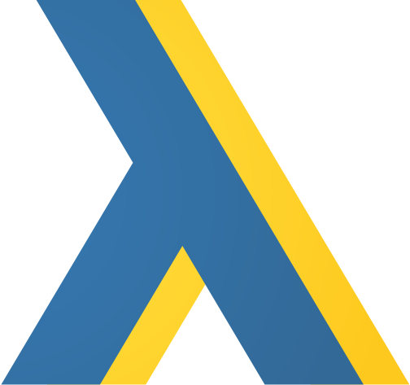

<div align="center">
    
</div>

<h1 align="center">ftools</h1>

Functional programming tools for Python inspired by Lodash FP and an extension
for Python standard functional libraries

```bash
pip install ftools
```


### [Documentation](https://khealth.github.io/fptools/)

### Features

- Performant and lean
- Simple and pythonic
- Immutable

### Develop

```bash
poetry config settings.virtualenvs.in-project true;
poetry config settings.virtualenvs.path .venv;
poetry install;
```

#### Lint

```bash
poetry run pylint ftools;
```

#### Format

```bash
poetry run black .;
```

#### Test

```bash
poetry run pytest;
```

#### Publish new version

Contact @iddan
